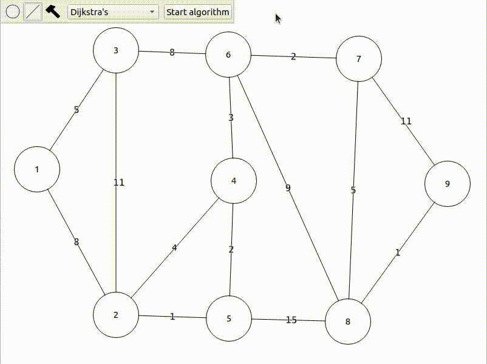

# Graphical graph representation
Graphical graph representation is a project written in c++/Qt allowing user to create a graph and perform algorithms on it.

## Overview
The program allows user to create nodes, link them with edges and destroy said nodes and edges. The edges are weighted or unweighted and directed or undirected depending on the chosen graph type. Then the user can perform algorithms on the graph with adequate visual effects.

Example of a undirected and weighted graph with Dijkstra's algorithm performed on it.


## Installation
### Linux
To run the program you need working installation of Qt.

clone the repo on your local machine:
  ```
  git clone https://github.com/ziemekb/graphical-graph-representation.git
  ```
And cd into the folder:
  ```
  cd graphical-graph-represention
  ```
Then execute the following commands: 
  ```
  qmake graphical-graph-representation.pro
  make
  ./graphical-graph-representation
  ```
